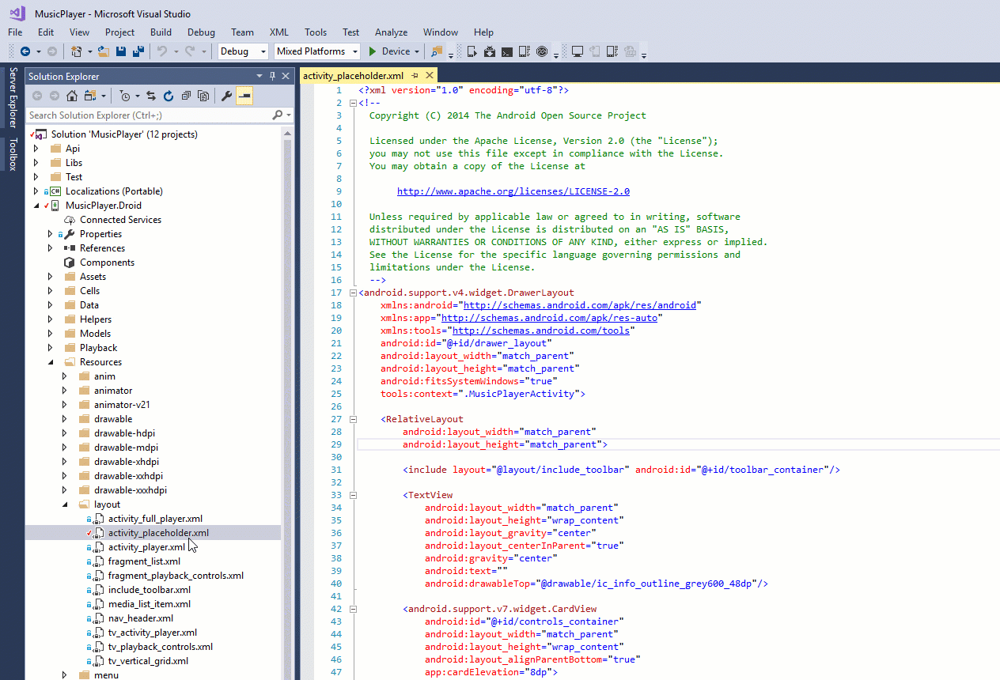

Xamaridea
=========

Visual Studio extension, allows editing .axml files in **IntelliJ IDEA** or **Android Studio** (Xamarin.Android). It creates a fake android project and uses resources from your Xamarin.Android project by link (thanks to gradle) so every change made in Android IDE will be saved. Available at https://visualstudiogallery.msdn.microsoft.com/9f5a516a-f4d0-4228-9d25-d0273abebf33

**WARNING:** Plugin may change your project structure (Resources folder), do not use it without version control (it's alfa version).

Tired?

Plugin will help!

